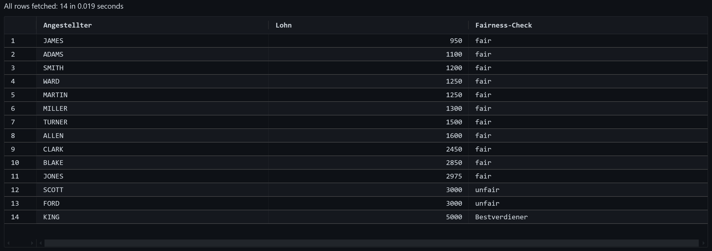

###### 
 DbiUebung-003 

  
  # PLSQL - Employee Fairness Check 

  - 
 Fertige Ausgabe: 
  
    > *Erst alle ( Hilfs- )*`FUNCTIONS` *kompilieren, dann kann die Ausgabe ausgeführt werden*!  
    

    
    

  - 
 Code Snippets: 

---

